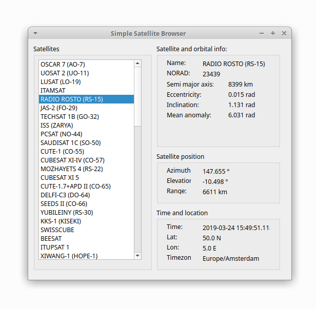

# Simple Satellite Browser

## Prerequisites

* PyQt5
* skyfield
* numpy
* pytz

## Running the script

Download some TLE text files from https://www.celestrak.com/NORAD/elements/ and put them in the /tle folder.

Run with:

```
python source/sat_browser.py
```

Upon running the script, skyfield will download several data files from international authorities —
the United States Naval Observatory and the International Earth Rotation Service —
to make sure that it has current information about both leap seconds and the orientation of the Earth.

## Features

simple-sat-browser reads satellites from a TLE file and builds satellite objects.
These can then be selected and live data displayed about the satellite.


